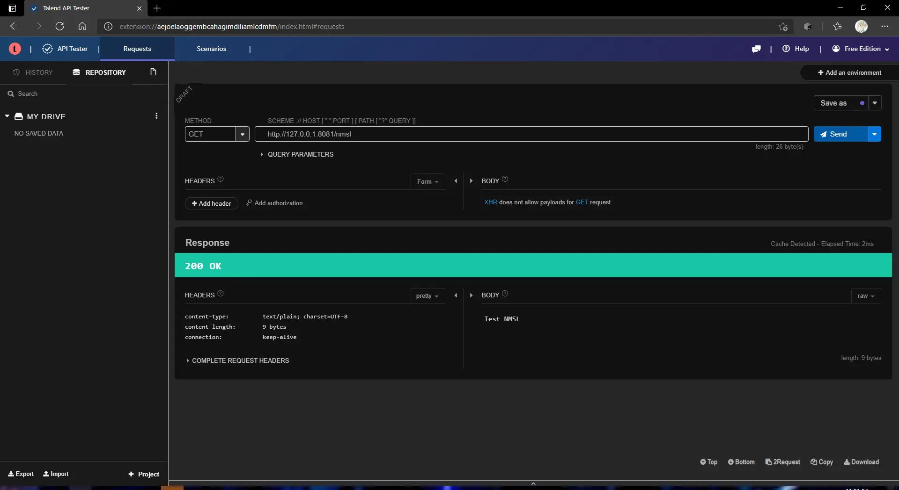
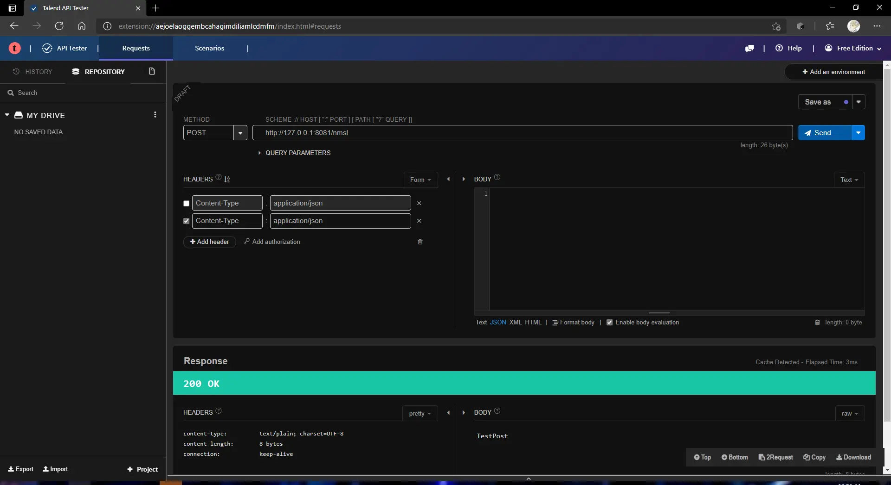
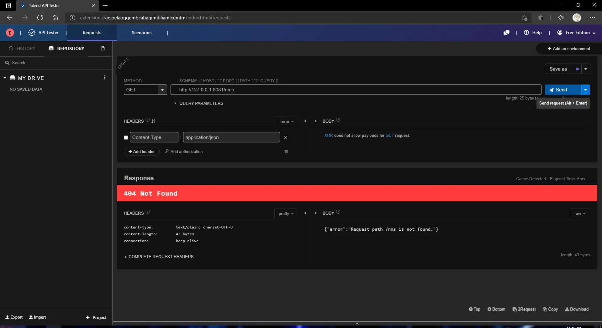

### Backend: 构建 Netty HTTP API 服务，封装。

Netty 是一款基于 NIO（Nonblocking I/O，非阻塞IO）开发的网络通信框架，对比于 BIO（Blocking I/O，阻塞 IO），他的并发性能得到了很大提高，并且 Netty 的易用程度远大于传统的 NIO Socket 编程。

> 引用自：https://www.jianshu.com/p/b9f3f6a16911

#### 启动服务：

在 [`backend/.../netty/NettyHttpServer.java`](../../backend/src/main/java/me/stageguard/oopcd/backend/netty/NettyHttpServer.java) 中：

```java
	public void start() throws Exception {
        ServerBootstrap b = new ServerBootstrap();
        NioEventLoopGroup group = new NioEventLoopGroup();
        b.group(group)
                .channel(NioServerSocketChannel.class)
                .childHandler(new ChannelInitializer<SocketChannel>() {
                    @Override
                    public void initChannel(SocketChannel ch) {
                        LOGGER.info("initChannel ch:" + ch);
                        ch.pipeline()
                            .addLast("decoder", new HttpRequestDecoder())
                            .addLast("encoder", new HttpResponseEncoder())
                            .addLast("aggregator", new HttpObjectAggregator(512 * 1024))
                            .addLast("handler", httpRequestHandler);
                    }
                })
                .option(ChannelOption.SO_BACKLOG, 128)
                .childOption(ChannelOption.SO_KEEPALIVE, Boolean.TRUE);
        b.bind(port).sync();
    }
```

1. 通过 Netty 的 `ServerBootstrap` 类来启动一个 Socket 服务器。
2. 通过 `childHandler(ChannelInitializer)` 来定义处理流程：
   - `decoder` 和 `encoder` 为 `HttpRequestDecoder` 和 `HttpResponseDecoder` 表明只解析 HTTP 服务。
   - `aggregator` 为 `HttpObjectAggregator` 表示将包大小小于 `512kb` 的请求合并在同一个 `Handler` 中进行处理。
   - `handler` 为自己定义的请求处理器。

最后通过 `bind(port).sync()` 来阻塞线程并启动服务。

> 目前还没有进行多线程优化，完成基本功能后会优化。

#### 处理请求：

在 [`backend/.../netty/HttpRequestHandler.java`](../../backend/src/main/java/me/stageguard/oopcd/backend/netty/HttpRequestHandler.java) 中：

```java
@ChannelHandler.Sharable
public class HttpRequestHandler extends SimpleChannelInboundHandler<FullHttpRequest> {

    private static final Logger LOGGER = LoggerFactory.getLogger(HttpRequestHandler.class);
    private final AsciiString contentType = HttpHeaderValues.TEXT_PLAIN;

    private ArrayList<? extends IRouteHandler> mHandlers = new ArrayList<>();

    public void setHandlers(ArrayList<IRouteHandler> handlers) {
        this.mHandlers = handlers;
    }

    @Override
    protected void channelRead0(ChannelHandlerContext ctx, FullHttpRequest msg) {
        DefaultFullHttpResponse response = null;
        for(IRouteHandler h : mHandlers) {
            var route = h.getClass().getAnnotation(Route.class);
            if(route != null) {
                var method = route.method();
                var path = route.path();
                if(msg.method().toString().equals(method) && msg.uri().equals(path)) {
                    try {
                        var handled = h.handle(msg);
                        response = new DefaultFullHttpResponse(HttpVersion.HTTP_1_1,
                                handled.getStatus(),
                                Unpooled.wrappedBuffer(handled.getContent().getBytes()));
                    } catch (Exception ex) {
                        response = new DefaultFullHttpResponse(HttpVersion.HTTP_1_1,
                                HttpResponseStatus.INTERNAL_SERVER_ERROR,
                                Unpooled.wrappedBuffer(("{\"error\":\"" + ex + "\"}").getBytes()));
                    }
                    break;
                }
            } else {
                var errorMsg = "Annotation \"Route\" is missing for class "
                        + h.getClass().getName()
                        + " which implements IRouteHandler.";
                response = new DefaultFullHttpResponse(HttpVersion.HTTP_1_1,
                        HttpResponseStatus.INTERNAL_SERVER_ERROR,
                        Unpooled.wrappedBuffer(("{\"error\":\"" + errorMsg + "\"}").getBytes()));
                break;
            }
        }
        if (response == null) {
            response = new DefaultFullHttpResponse(HttpVersion.HTTP_1_1,
                    HttpResponseStatus.NOT_FOUND,
                    Unpooled.wrappedBuffer(("{\"error\":\"Request path "
                            + msg.uri()
                            + " is not found.\"}").getBytes())
            );
        }
        HttpHeaders heads = response.headers();
        heads.add(HttpHeaderNames.CONTENT_TYPE, contentType + "; charset=UTF-8");
        heads.add(HttpHeaderNames.CONTENT_LENGTH, response.content().readableBytes());
        heads.add(HttpHeaderNames.CONNECTION, HttpHeaderValues.KEEP_ALIVE);
        ctx.write(response);
    }

    @Override
    public void channelReadComplete(ChannelHandlerContext ctx) throws Exception { }

    @Override
    public void exceptionCaught(ChannelHandlerContext ctx, Throwable cause) { }
}
```

处理流程定义在 `protected void channelRead0(ChannelHandlerContext ctx, FullHttpRequest msg)` 中，充分考虑到了 `Not Found`，`Internal Error` 的情况。

在 `channelRead0` 中遍历了 `mHandlers`，他们是自定义的路由处理器，[`IRouteHandler`](../../backend/src/main/java/me/stageguard/oopcd/backend/netty/IRouteHandler.java) 接口的定义如下：

```java
@Route
public interface IRouteHandler {
    ResponseContentWrapper handle(FullHttpRequest request);
}

```

包含一个 `handle` 方法，为实际处理数据的方法。

在 `channelRead0` 中还获取了一个 Annotation，即 [`Ruote`](../../backend/src/main/java/me/stageguard/oopcd/backend/netty/Ruote.java)，他的定义如下：

```java
@Target(ElementType.TYPE)
@Retention(RetentionPolicy.RUNTIME)
public @interface Route {
    String method() default "GET";
    String path() default "/";
}
```

该 Annotation 用于指定路由地址和请求方法。

之所以使用 Annotation 的方式来指定是因为这样使得指定不同的路由变得非常简单且方便：

```java
@Route(path = "/nmsl")
public class TestHandler implements IRouteHandler {
    @Override
    public ResponseContentWrapper handle(FullHttpRequest request) {
        return new ResponseContentWrapper(HttpResponseStatus.OK, "Test NMSL");
    }
}
```

只需要简单地为这个类标注 `@Ruote` 即可，简化类中的代码量。

#### 测试结果：





