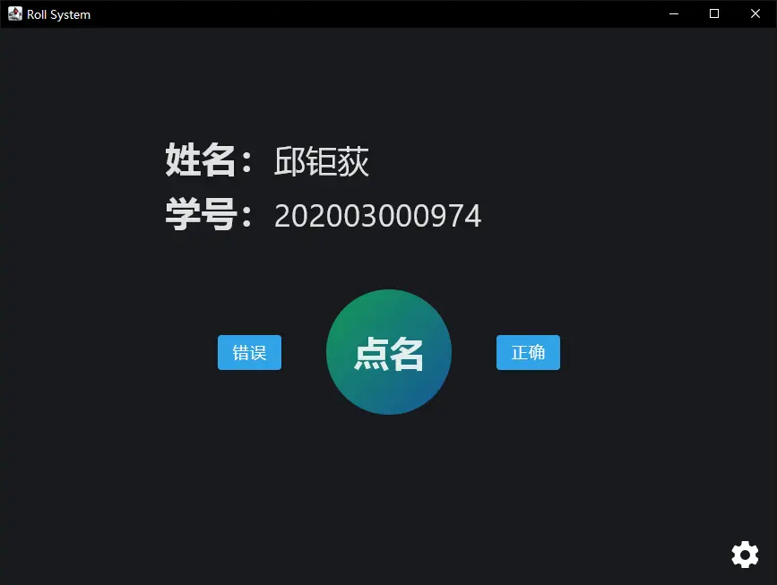
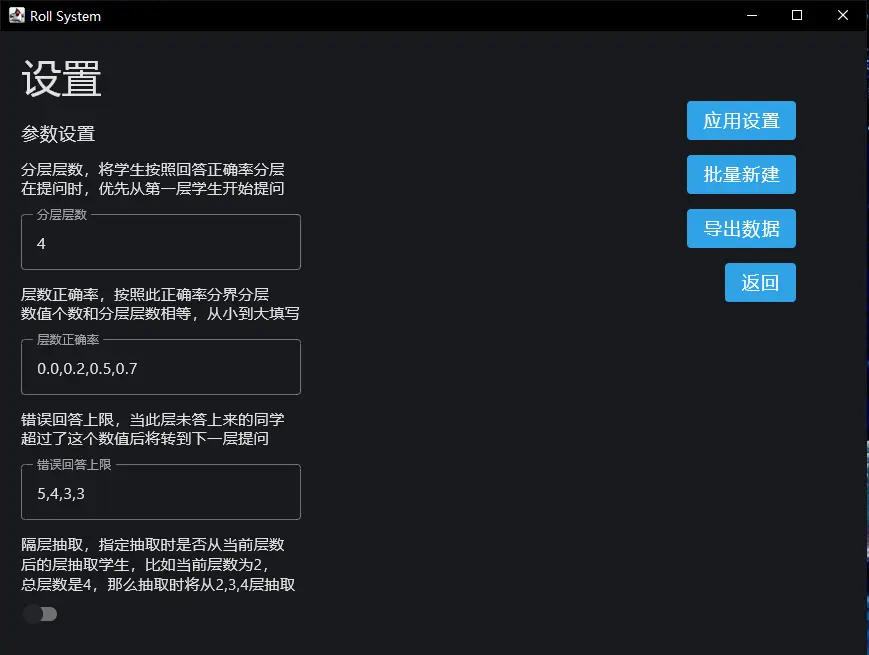

## OOPJavaCurriculumDesign

### 课程设计：基于有状态的课堂点名系统

现在课堂教师点名回答问题，往往是随机点名。由于教师习惯等因素往往造成有的同学被点名次数多，有的同学被点名次数少。希望设计一个点名系统使得学生在一个学期的上课过程中可以获得相同的点名机会。

特性：

- **导入学生功能**：可从 Excel 或文本文件中导入学生信息，或者可以批量新建学生亦可。
- **状态存储功能**：该系统需记录每个学生的被点名次数，回答出问题的次数。
- **点名功能**：每次点名选择同学时需要基于该同学已经被点名的次数，如果点名超过n个同学还未回答出该问题则从已有的回答出来次数较多的同学中随机抽取。
- 统计功能：可将每个学生的被点名次数、回答出问题的次数、比率统计出来。

要求：界面Web，后台存储数据库或者文件。

进阶：基于手机 app。

#### 课题分析 & 项目结构：

1. 有批量导入学生功能，需要大量存储数据，使用 `MySQL` 作为数据存储后端。
2. 设计后台，提供给前端 `Web(HTTP) API`。
    - 后端使用 `Java` 语言作为主语言编写。
    - 使用 `Netty` 作为服务器框架，使用 `JDBC`(`HikariCP` for connection pool) 与数据库连接。
    - 后端为前端提供 `HTTP API` 用于与后端交互。
3. 前端分为 `Web 前端`, `Android 移动前端` 和 `Desktop 桌面前端` ，他们通过 `HTTP API` 与后端服务器交互。
    - 使用基于 `Kotlin` 语言的 `compose-jb` 作为 UI 框架。
    - 使用 `ktor` 作为 HTTP Client 框架。

[](https://mermaid-js.github.io/mermaid-live-editor/edit##eyJjb2RlIjoiZ3JhcGggTFJcbiAgICBiYWNrZW5kKEJhY2tlbmQpXG4gICAgZnJvbnRlbmRhbmRyb2lkKFwiRnJvbnRlbmQ6IEFuZHJvaWRcIilcbiAgICBmcm9udGVuZHdlYihcIkZyb250ZW5kOiBXZWJcIilcbiAgICBkYXRhYmFzZShcIkRhdGFiYXNlXCIpXG4gICAgZGF0YWJhc2UgLS0-IHxhY2Nlc3N8YmFja2VuZFxuICAgIGJhY2tlbmQgLS0-IHxIVFRQIEFQSXxmcm9udGVuZHdlYlxuICAgIGJhY2tlbmQgLS0-IHxIVFRQIEFQSXxmcm9udGVuZGFuZHJvaWQiLCJtZXJtYWlkIjoie1xuICBcInRoZW1lXCI6IFwiZGVmYXVsdFwiXG59IiwidXBkYXRlRWRpdG9yIjpmYWxzZSwiYXV0b1N5bmMiOnRydWUsInVwZGF0ZURpYWdyYW0iOmZhbHNlfQ)

#### 项目特性：

- 前后端分离，便于管理。前后端通信采用 `HTTP API`。
- 可以灵活调整算法参数，灵活适应不同的上课提问场景。
- 拥有优美的 UI 界面，遵守 `Material Design` 设计规则。
- ......

#### 前端截图：

- Frontend: Desktop

<table>
<tr>
    <td align="center" height="200">
        
    </td>
    <td align="center" height="200">
        
    </td>
</tr>
</table>

### 开发过程：

1. [初始化项目，配置 `gradle` 子项目](article/01-init-project-and-configure-gradle.md)

2. [Backend: 构建 Netty HTTP API 服务，封装](article/02-build-netty-http-api.md)

3. [Backend: 抽象简化 HTTP 请求和回应](article/03-abstract-dto.md)

4. [Backend: 封装数据库 DAO 模式](article/04-wrap-database-dao.md)

5. [Backend: 基于状态点名实现](article/05-roll.md)

   
